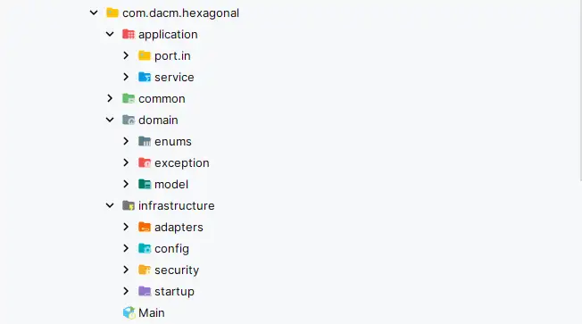
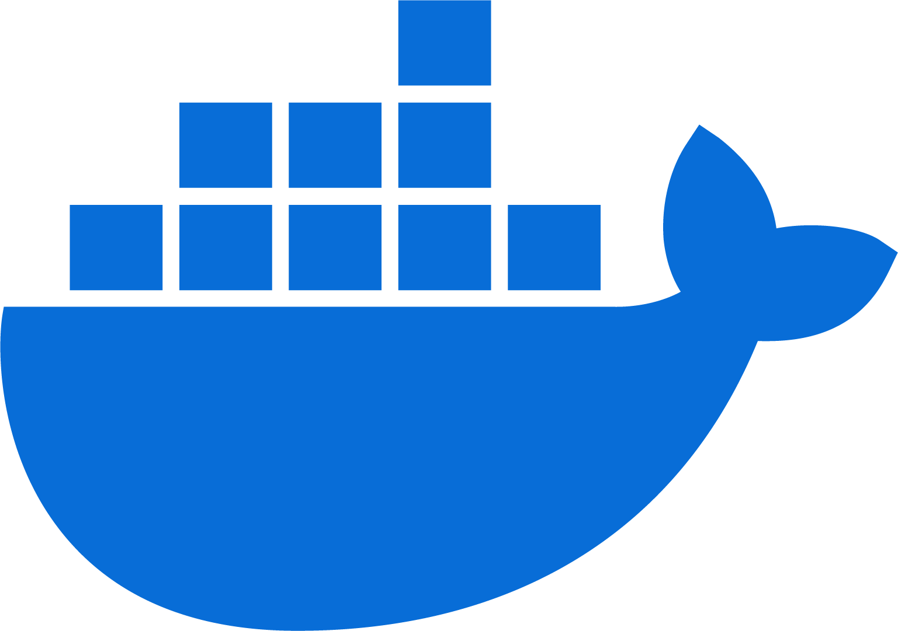
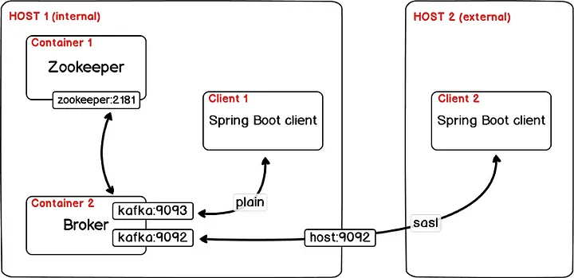
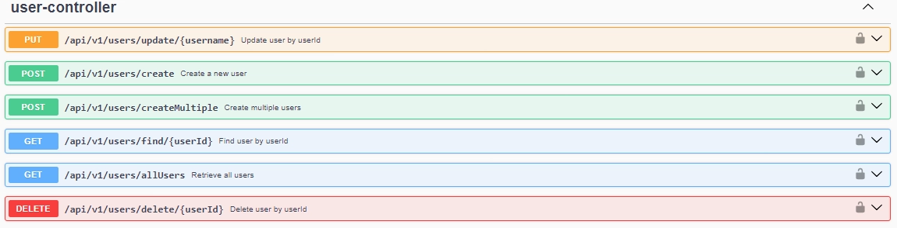

# HexagonalArchitecture-SpringBoot-MongoDB-CoWorkingBooking

## Descripción del Proyecto

HexagonalArchitecture-SpringBoot-MongoDB-CoWorkingBooking es una aplicación integral para gestionar reservas de coworking de forma eficiente y segura. Combina una arquitectura modular (Hexagonal), un marco de desarrollo eficaz (SpringBoot), una base de datos escalable (MongoDB), una API flexible (REST), una plataforma de contenedores portátil (Docker), un sistema de mensajería asíncrono (Kafka) y documentación completa (Swagger Doc).


## Características Principales

- **Autenticación de Usuarios con JWT**: Utiliza tokens JWT para asegurar que solo usuarios autenticados puedan acceder a la API.
- **Roles de Usuario**: Gestión de permisos específicos para diferentes roles de usuario, como administrador y usuario.
- **Arquitectura Hexagonal**: Diseño modular que facilita la integración de nuevos componentes y servicios.
- **Patrones de Diseño**: Implementación de patrones como Builder, DTOs (Data Transfer Objects) y MVC (Modelo-Vista-Controlador) para un código organizado y limpio.
- **Paginación y Filtrado de Datos**: Métodos que optimizan las consultas HTTP y permiten filtrar datos de manera eficiente.
- **Operaciones CRUD**: Creación, lectura, actualización y eliminación de reservas, usuarios y espacios.
- **Validación de Reservas**: Verificación automática cada hora para desactivar reservas caducadas y evitar la creación de reservas en horarios ya ocupados.
- **Notificaciones por Correo Electrónico**: Envío de correos para recuperación y actualización de contraseñas, así como notificaciones de registro, creación, confirmación y cancelación de reservas, utilizando Thymeleaf para generar plantillas HTML.
- **Pruebas de Integración**: Cobertura de pruebas en todas las capas del sistema con un 97.2% de éxito en métodos y un 94.3% en líneas de código.
- **Documentación con Swagger**: Documentación de los endpoints de la API para facilitar su uso y comprensión.
- **Habilitación de CORS**: Permite el acceso a los endpoints desde diferentes dominios.
- **Implementación con Docker**: Contenedores Docker para la aplicación, Kafka y Zookeeper.
- **Kafka para Mensajería Asíncrona**: Utilización de Kafka para reducir tiempos de respuesta y realizar tareas de manera asincrónica.
- **MongoDB Atlas**: Utilización de MongoDB Atlas para alojar la base de datos, garantizando escalabilidad y disponibilidad.

---

## Arquitectura Hexagonal
La arquitectura hexagonal, también conocida como arquitectura de puertos y adaptadores, es un diseño de software que busca crear aplicaciones altamente desacopladas y flexibles. Y se basa en la idea de aislar el núcleo de la aplicación de las dependencias externas, como bases de datos, interfaces de usuario y servicios externos.

### Ventajas

1. **Desacoplamiento**: Facilita la separación entre el dominio de negocio y las dependencias externas, lo que permite cambiar componentes externos sin afectar la lógica central de la aplicación.
2. **Flexibilidad**: Permite agregar nuevas funcionalidades o reemplazar partes del sistema (como bases de datos o interfaces de usuario) sin afectar el núcleo de la aplicación.
3. **Testabilidad**: Facilita la realización de pruebas unitarias e integrales, ya que el núcleo de la aplicación puede ser probado en aislamiento de las dependencias externas.
4. **Mantenimiento**: Mejora la mantenibilidad del código al mantener una clara separación de responsabilidades y reducir la complejidad del sistema.
5. **Evolución**: Facilita la evolución del sistema, permitiendo incorporar nuevas tecnologías o adaptar la aplicación a nuevos requisitos sin grandes reestructuraciones.

La estructura típica de una arquitectura hexagonal se organiza en capas, con el núcleo de la aplicación en el centro y los adaptadores que interactúan con el mundo exterior en la periferia, conectados a través de puertos.

[](https://www.linkedin.com/in/dacm1/)
[](https://www.linkedin.com/in/dacm1/)

---

## Docker

[](https://www.redhat.com/es/topics/containers/what-is-docker)

**¿Qué es Docker?**
Docker es una plataforma de código abierto que permite desarrollar, empaquetar y ejecutar aplicaciones en contenedores. Los contenedores son unidades de software livianas y portátiles que incluyen todo lo necesario para ejecutar una aplicación, incluidas bibliotecas, herramientas y código.

**Integración en tu Proyecto**
Docker facilita la creación de un entorno de desarrollo y despliegue consistente para tu proyecto. Permite empaquetar tu aplicación y sus dependencias en contenedores, lo que simplifica la implementación y garantiza que la aplicación se ejecute de la misma manera en cualquier entorno.

---

## Kafka

[]()

**¿Qué es Kafka?**
Apache Kafka es una plataforma de mensajería distribuida de código abierto que se utiliza para la construcción de sistemas de procesamiento de datos en tiempo real y la transmisión de eventos a gran escala. Funciona como un sistema de publicación/suscripción, donde los productores publican mensajes en un tema y los consumidores los leen de ese tema.

**Integración de Kafka en Docker**
Kafka se puede integrar en Docker para crear un clúster de Kafka utilizando contenedores. Cada contenedor representa un nodo en el clúster, permitiendo la escalabilidad y la tolerancia a fallos. Docker facilita la gestión y la implementación del clúster Kafka de manera rápida y sencilla.

[]()

**Utilidad en Spring**

1. **Mensajería Asíncrona**: Permite la comunicación asíncrona entre diferentes componentes de tu aplicación, lo que puede mejorar la escalabilidad y el rendimiento.
2. **Procesamiento de Eventos**: Kafka puede ser utilizado para procesar eventos en tiempo real, como notificaciones de reserva o actualizaciones de datos, lo que permite una respuesta más rápida a los cambios en tu sistema.
3. **Gestión de Colas**: Puedes utilizar Kafka como una cola de mensajes para manejar tareas en segundo plano, como el envío de correos electrónicos o la generación de informes.

Integrar Kafka en Docker te proporciona un entorno de desarrollo y pruebas consistente y portátil, facilitando la gestión y la implementación de tu aplicación de Spring que utiliza Kafka para la mensajería y el procesamiento de eventos.

---

## Swagger/OpenAPI

**¿Qué es Swagger/OpenAPI?**

Swagger/OpenAPI es un conjunto de herramientas que permite diseñar, construir, documentar y consumir servicios web de forma sencilla y efectiva. Proporciona una especificación de API que describe todos los endpoints, parámetros, respuestas y otros detalles necesarios para interactuar con la API de manera programática.

**Integración de Swagger**

Con Swagger/OpenAPI, puedes generar automáticamente documentación interactiva para tu API, lo que facilita su comprensión y uso por parte de otros desarrolladores. Además, te permite probar tus endpoints directamente desde la documentación generada, lo que agiliza el proceso de desarrollo y depuración.

[]()
---

## Tecnologías Utilizadas

- Java jdk-17
- Spring Boot 3
- Maven
- MongoDB
- Docker
- JWT
- SwaggerDoc
- Junit5
- Thymeleaf
- Postman 
- IntelliJ IDE

---

## Configuración del Entorno y Prerrequisitos

Asegúrate de tener instalados los siguientes componentes en tu entorno de desarrollo antes de comenzar:

- [Git](https://git-scm.com/downloads)
- [Maven](https://maven.apache.org/download.cgi)
- [Java jdk-17](https://www.oracle.com/java/technologies/javase/jdk17-archive-downloads.html)
- [Docker](https://docs.docker.com/)
- [Kafka](https://kafka.apache.org/downloads)

---

## Instrucciones de Uso

Sigue estos pasos para ejecutar la aplicación en tu entorno local:

#### Clonar el repositorio en tu máquina local
```
git clone https://github.com/dacm1999/HexagonalArchitecture-SpringBoot-MongoDB-CoWorkBooking
```
#### Navegar al directorio del proyecto
```
cd 01-CoWorkBooking-Backend
```
#### Limpia y empaqueta el proyecto utilizando Maven
```
mvn package -DskipTests
```
#### inicia la aplicación Spring Boot
```
mvn spring:run
```

---

## Base URL

- [http://localhost:2023](http://localhost:8080)

## API Endpoints

### Booking

| Método   | Endpoint                                            | Descripción                                             |
|----------|-----------------------------------------------------|---------------------------------------------------------|
| PUT      | `/api/v1/bookings/confirm/{bookingId}`              | Confirmar una reserva                                   |
| PUT      | `/api/v1/bookings/cancel/{bookingId}`               | Cancelar una reserva                                    |
| POST     | `/api/v1/bookings/create`                           | Crear una reserva                                       |
| POST     | `/api/v1/bookings/createMultiple`                   | Crear múltiples reservas                                |
| PATCH    | `/api/v1/bookings/update/{bookingId}`               | Actualizar una reserva por ID                           |
| GET      | `/api/v1/bookings/user/{userId}`                    | Obtener reservas por ID de usuario                      |
| GET      | `/api/v1/bookings/status/{status}`                  | Obtener reservas por estado                             |
| GET      | `/api/v1/bookings/find/{bookingId}`                 | Obtener una reserva por ID                              |
| GET      | `/api/v1/bookings/availableHours/{spaceId}/{date}`  | Obtener horas disponibles para una fecha y espacio      |
| GET      | `/api/v1/bookings/all`                              | Obtener todas las reservas con paginación               |
| GET      | `/api/v1/bookings/allByStartDate/{startDate}`       | Obtener todas las reservas por fecha de inicio          |
| DELETE   | `/api/v1/bookings/delete/{bookingId}`               | Eliminar una reserva                                    |

### Users

| Método   | Endpoint                                            | Descripción                                             |
|----------|-----------------------------------------------------|---------------------------------------------------------|
| PUT      | `/api/v1/users/update/{username}`                   | Actualizar usuario por ID de usuario                     |
| POST     | `/api/v1/users/create`                              | Crear un nuevo usuario                                  |
| POST     | `/api/v1/users/createMultiple`                      | Crear múltiples usuarios                                |
| GET      | `/api/v1/users/find/{userId}`                       | Encontrar usuario por ID de usuario                     |
| GET      | `/api/v1/users/allUsers`                            | Obtener todos los usuarios                              |
| DELETE   | `/api/v1/users/delete/{userId}`                     | Eliminar usuario por ID de usuario                      |

### Spaces

| Método   | Endpoint                                            | Descripción                                             |
|----------|-----------------------------------------------------|---------------------------------------------------------|
| PUT      | `/api/v1/spaces/update/{spaceId}`                   | Actualizar un espacio por ID                            |
| POST     | `/api/v1/spaces/create`                             | Crear un nuevo espacio                                  |
| POST     | `/api/v1/spaces/createMultiple`                     | Crear múltiples espacios                                |
| GET      | `/api/v1/spaces/find/{spaceId}`                     | Encontrar un espacio por ID                             |
| GET      | `/api/v1/spaces/all`                                | Encontrar todos los espacios                            |
| GET      | `/api/v1/spaces/allUnAvailable`                     | Obtener todos los espacios no disponibles               |
| GET      | `/api/v1/spaces/allAvailable`                       | Obtener todos los espacios disponibles                  |
| DELETE   | `/api/v1/spaces/delete/{spaceId}`                   | Eliminar un espacio por ID                              |

### Password

| Método   | Endpoint                                            | Descripción                                             |
|----------|-----------------------------------------------------|---------------------------------------------------------|
| PUT      | `/api/v1/password/update/{userId}`                  | Actualizar la contraseña                                |
| PUT      | `/api/v1/password/reset`                            | Restablecer la contraseña                               |

### Register

| Método   | Endpoint                                            | Descripción                                             |
|----------|-----------------------------------------------------|---------------------------------------------------------|
| POST     | `/api/v1/register`                                  | Registrar un nuevo usuario                              |

### Login

| Método   | Endpoint                                            | Descripción                                             |
|----------|-----------------------------------------------------|---------------------------------------------------------|
| POST     | `/api/v1/login/auth`                                | Autenticar usuario y devolver token JWT                 |


---
## Recursos Adicionales

Aquí hay algunos recursos adicionales que podrían ser útiles:

- [Documentacion de open jdk 17](https://docs.oracle.com/en/java/javase/17/docs/api/)
- [Documentacion de Spring boot](https://docs.spring.io/spring-boot/docs/current/reference/htmlsingle/)
- [Documentacion de Spring Data MongoDB](https://spring.io/projects/spring-data-mongodb)
- [Documentacion de Maven](https://maven.apache.org/guides/getting-started/)
- [Documentacion de Kafka](https://kafka.apache.org/documentation/)
- [Documentacion de Swagger](https://swagger.io/docs/specification/about/)