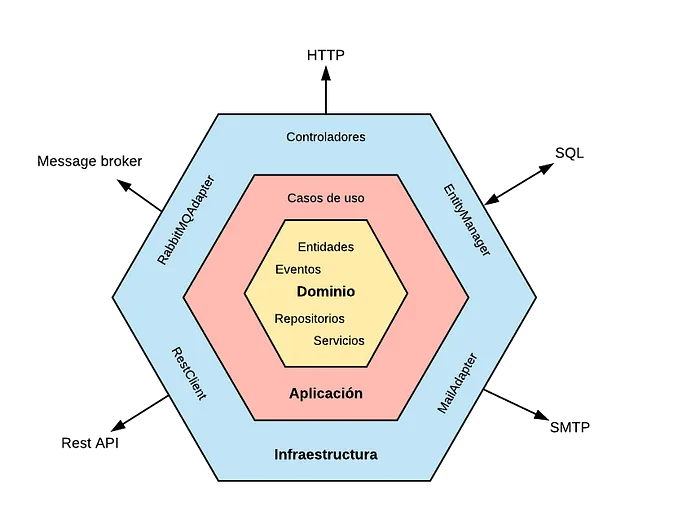

# HexagonalArchitecture-SpringBoot-MongoDB-CoWorkingBooking
This repository contains a co-working space reservation system using Spring Boot and MongoDB. It demonstrates user authentication, space management, and booking features within a hexagonal architecture, showcasing my software development expertise.

---

